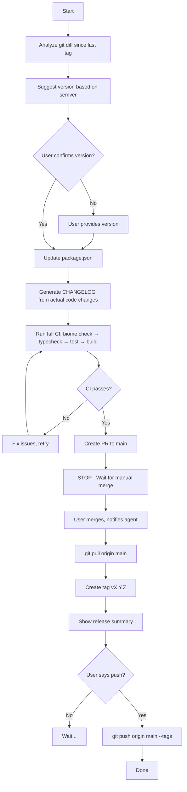

# Releasing opencode-stats-engine

## Overview

Controlled release workflow for opencode-stats-engine with mandatory human approval gates. Enforces: version suggestion → PR → manual merge → tag → push (only when explicitly approved).

**Core principle:** Never auto-merge, never auto-push. Human controls the merge and final push.

## When to Use

- Releasing a new version (stable, beta, alpha)
- User says "release", "publish", "bump version", "发版"

## Release Flow



## Step-by-Step Instructions

### Step 1: Analyze Changes & Suggest Version

```bash
# Get last tag
git describe --tags --abbrev=0

# Analyze actual code changes (NOT just commit messages)
git diff $(git describe --tags --abbrev=0)..HEAD --stat
git diff $(git describe --tags --abbrev=0)..HEAD -- packages/
```

**Version suggestion rules (semver):**
- **Major (X.0.0)**: Breaking changes, API removal, config format change
- **Minor (0.X.0)**: New features, new event types, new projections
- **Patch (0.0.X)**: Bug fixes, docs, internal refactors
- **Pre-release (1.0.0-beta.N)**: Increment N for any change during beta

**Special cases:**
- **Only docs/images changed**: Still bump patch (e.g., beta.5 → beta.6)
- **No changes since last tag**: Ask user if they still want to release

**Present to user:**
```
Changes since vX.Y.Z:
- [list key changes from git diff --stat]
- Code changes (packages/): [summary or "none"]
- Docs/other: [summary]

Suggested version: vX.Y.Z (reason: ...)
Confirm? Or provide your version:
```

### Step 2: Update package.json

```bash
# Use npm version to update, or manually edit
# Verify change
cat package.json | grep '"version"'
```

### Step 3: Generate CHANGELOG

**CRITICAL: Base CHANGELOG on actual code changes, NOT commit messages.**

```bash
# Get detailed diff for changelog analysis
git diff $(git describe --tags --abbrev=0)..HEAD -- packages/

# Focus on:
# - New exports/APIs (packages/shared/src/types/)
# - New features (packages/engine/src/api/, packages/engine/src/projection/)
# - Bug fixes (look for "fix", "bug" in diff context)
# - Breaking changes (removed exports, changed signatures)
# - Config changes (new env vars, new options)
```

**CHANGELOG format:**
```markdown
## [X.Y.Z] - YYYY-MM-DD

### Added
- New feature X (from diff: file.ts:line)

### Fixed
- Bug Y (from diff: file.ts:line)

### Changed
- Breaking change Z (from diff: file.ts:line)

### Internal
- Refactored W (not user-facing)
```

### Step 4: Run Full CI

```bash
bun run biome:check
bun run typecheck
bun test
bun run build:dashboard
bun run build
```

**ALL must pass. No exceptions.**

### Step 5: Create PR

```bash
git add -A
git commit -m "release: vX.Y.Z"
git push origin HEAD
gh pr create --base main --title "release: vX.Y.Z" --body "..."
```

**STOP HERE. Do NOT merge. Do NOT enable auto-merge.**

Say to user:
```
PR created: [link]
Waiting for manual merge. Notify me when merged.
```

### Step 6: After User Notifies Merge

```bash
git checkout main
git pull origin main
```

### Step 7: Create Tag

```bash
git tag -a vX.Y.Z -m "Release vX.Y.Z"
```

### Step 8: Show Summary & Wait for Push

**Display release summary:**
```
## Release Summary: vX.Y.Z

### Changes
[CHANGELOG content]

### Artifacts
- Tag: vX.Y.Z
- Branch: main

### Ready to push
Awaiting your approval to: git push origin main --tags
```

**STOP. Wait for explicit "push" command.**

### Step 9: Push (Only When Explicitly Told)

```bash
git push origin main --tags
```

## Anti-Patterns & Rationalizations

| Excuse | Reality |
|--------|---------|
| "User said 'release', that implies push" | Release ≠ push. Always ask. |
| "PR is approved, can auto-merge" | Never auto-merge. Wait for manual merge notification. |
| "Changelog from commits is faster" | Commits lie about actual changes. Use git diff. |
| "CI takes too long, skip it" | CI is mandatory. No shortcuts. |
| "User is waiting, push now" | User is waiting for YOUR summary, not for you to push. |
| "Tag exists, push is just formality" | Push is NEVER a formality. Always ask. |

## Red Flags - STOP Immediately

- Auto-merging PR
- Pushing without explicit "push" command
- Generating CHANGELOG from commit messages only
- Skipping CI steps
- Assuming user wants to push after tagging

## Quick Reference

| Gate | Action Required |
|------|-----------------|
| Version | User confirms or provides |
| PR Merge | User manually merges, then notifies |
| Push | User explicitly says "push" |

## Example Interaction

```
Agent: Analyzing changes since v1.0.0-beta.5...
Agent: [shows git diff summary]
Agent: Suggested version: v1.0.0-beta.6 (3 bug fixes, 1 new projection)
Agent: Confirm?
User: yes
Agent: [updates package.json, generates CHANGELOG, runs CI, creates PR]
Agent: PR #42 created: https://github.com/...
Agent: Waiting for manual merge. Notify me when merged.
User: merged
Agent: [pulls, creates tag]
Agent: ## Release Summary: v1.0.0-beta.6
Agent: [shows full summary]
Agent: Awaiting your approval to: git push origin main --tags
User: push
Agent: [pushes] Done.
```
