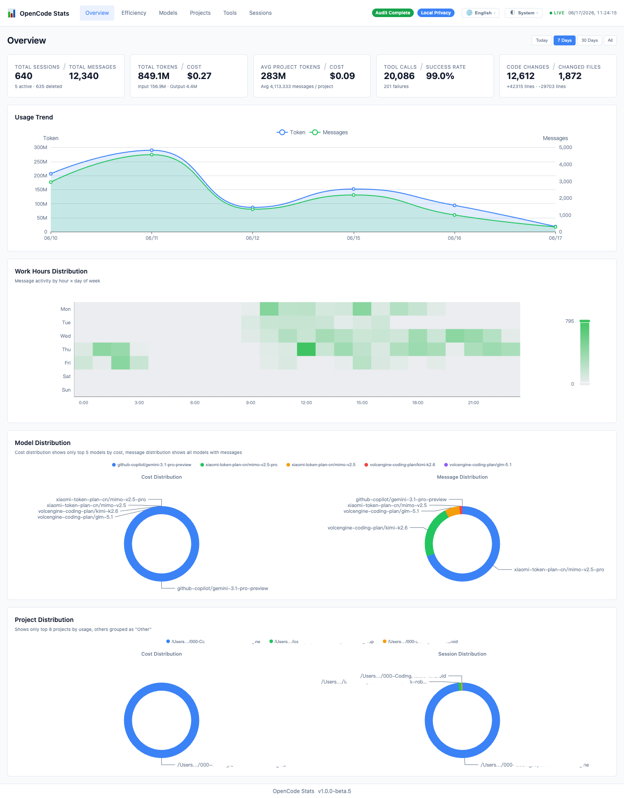
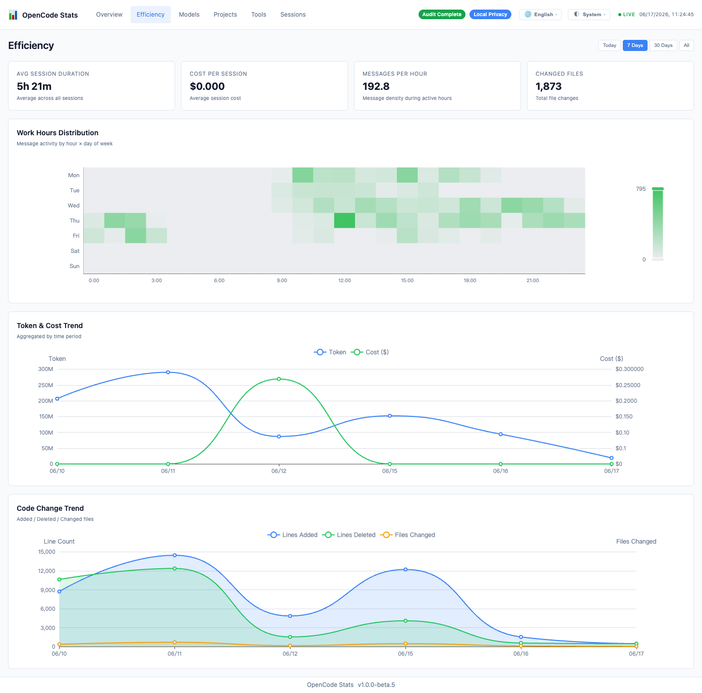
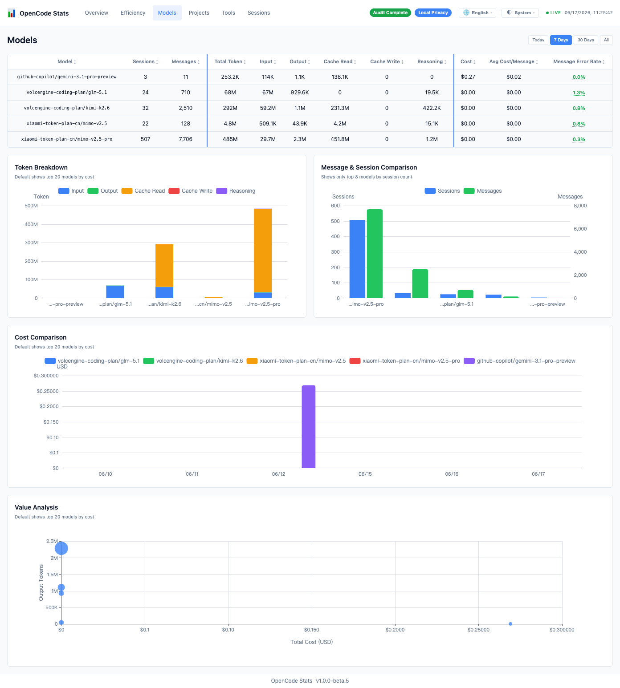
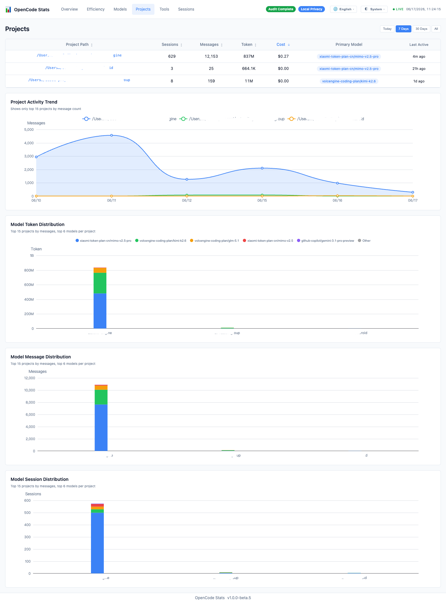
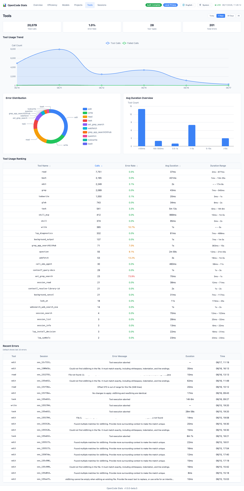
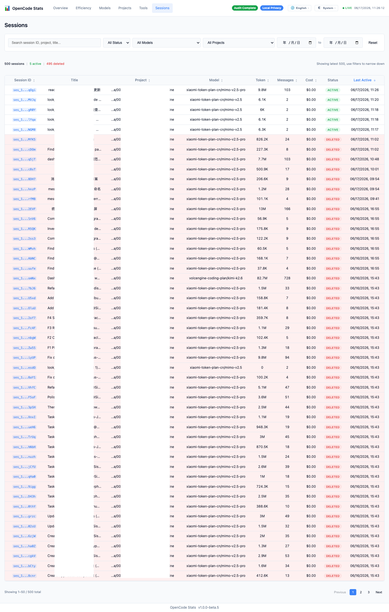

# opencode-stats-engine

[English](README.md) | [中文](README.zh-CN.md)

OpenCode Event-Sourced Stats Engine Plugin. Monitors OpenCode events, persists session/message/tool-execution data to local SQLite, and provides a local stats dashboard, REST API, and SSE real-time updates.

## Features

- **Event Capture**: Listens to OpenCode sessions, messages, and tool execution events.
- **Local Persistence**: Appends events to SQLite (default: `~/.local/share/opencode-stats-engine/stats.db`).
- **Statistical Projections**: Projects raw events into aggregated statistics for sessions, messages, tool calls, etc.
- **Local Dashboard**: Serves a Vue 3 dashboard and `/api/v1/dashboard/*` API via Hono.
- **Real-time Updates**: Pushes SSE update notifications to the dashboard via `/api/v1/dashboard/stream`.
- **Multi-instance Coordination**: When multiple OpenCode instances run simultaneously, only the leader serves HTTP; followers continue writing local data.

## Quick Start

Add the plugin to your `opencode.json` configuration:

```json
{
  "$schema": "https://opencode.ai/config.json",
  "plugin": ["opencode-stats-engine"]
}
```

After saving the configuration, start OpenCode normally. OpenCode will load `opencode-stats-engine` according to the plugin configuration. Once loaded, the plugin initializes the local database, projection engine, and HTTP server, and processes OpenCode events via the generic `event` hook.

Then open your browser at:

```
http://127.0.0.1:11133
```

The default port is `11133`, configurable via `STATS_PORT`.

## Environment Variables

| Variable | Default | Description |
| --- | --- | --- |
| `STATS_PORT` | `11133` | Local dashboard and API listening port |
| `STATS_DB_DIR` | `~/.local/share/opencode-stats-engine/` | Directory for SQLite database and log files |
| `STATS_DB_PATH` | `$STATS_DB_DIR/stats.db` | SQLite database file path |

## Dashboard & API

The plugin includes a pre-built Vue 3 dashboard and provides the following API endpoints:

- `GET /api/v1/dashboard/overview`
- `GET /api/v1/dashboard/efficiency`
- `GET /api/v1/dashboard/models`
- `GET /api/v1/dashboard/projects`
- `GET /api/v1/dashboard/tools`
- `GET /api/v1/dashboard/sessions`
- `GET /api/v1/dashboard/sessions/:id`
- `GET /api/v1/dashboard/stream` (SSE)

All Dashboard APIs support an optional `tz` query parameter (e.g., `Asia/Shanghai`, `America/New_York`). The `tz` parameter only affects date/hour bucketing in the response; timestamps in the database and all `*_ms` fields always remain in UTC milliseconds epoch.

## Data & Privacy

- Data is written only to local SQLite and never uploaded to remote services.
- Dashboard APIs do not return message bodies, tool inputs, tool outputs, or raw payloads.
- Fields like `tool_input`, `tool_output`, `message_body`, `raw_input`, `raw_output` are excluded from displayable metadata.
- Logs are written to `STATS_DB_DIR/stats.log` by default for local troubleshooting.

## Development

The following content is for developers of this repository. The project uses a Bun workspace monorepo containing `packages/{plugin,engine,shared,dashboard}`. The tech stack includes Bun, TypeScript, Biome, Hono, and a Vue 3 dashboard located in `packages/dashboard/`.

```bash
bun install
bun run biome:check
bun run typecheck
bun test
bun run build:dashboard
bun run build
```

Common test commands:

```bash
bun test
bun test packages/engine/tests/projection/engine.test.ts
bun test --test-name-pattern "routes"
```

The dashboard development server can be started separately, with `/api` proxied to `http://127.0.0.1:11133` by default:

```bash
bun run --cwd packages/dashboard dev
```

Auto-fix:

```bash
bun run biome:fix
bun run biome:fix-unsafe
```

## Dashboard Preview

### Overview



### Efficiency Analysis



### Model Statistics



### Projects Comparison



### Tool Calls



### Session List



## License

MIT